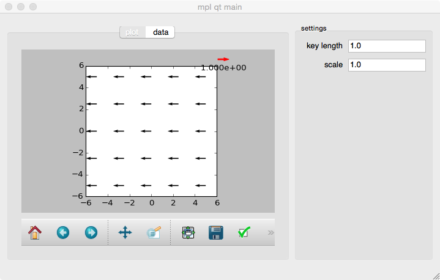

.. mpl_qt documentation master file, created by
   sphinx-quickstart on Thu May  7 23:56:14 2015.
   You can adapt this file completely to your liking, but it should at least
   contain the root `toctree` directive.

mpl_qt - A Matplotlib - PySide Project
======================================

Set up a PySide GUI application that displays an interactive Matplotlib figure.
The project is documented with sphinx (using the
`Napoleon extension <http://sphinx-doc.org/latest/ext/napoleon.html>`_).

.. todo::
   Get inspired by automatically created plots http://matplotlib.org/devel/documenting_mpl.html

.. todo::
   http://stackoverflow.com/questions/13529985/how-to-set-sphinxs-exclude-patterns-from-the-command-line

Contents
--------

.. ifconfig:: doc == ''

   .. toctree::
      :maxdepth: 2
   
      executables
      modules

.. ifconfig:: doc == 'user'

   .. toctree::
      :maxdepth: 2
   
      executables

.. ifconfig:: doc == ''

   TODO
   ----
   
   .. todolist::
   

.. ifconfig:: doc == ''

   Indices and tables
   ==================
   
   * :ref:`genindex`
   * :ref:`modindex`
   * :ref:`search`
